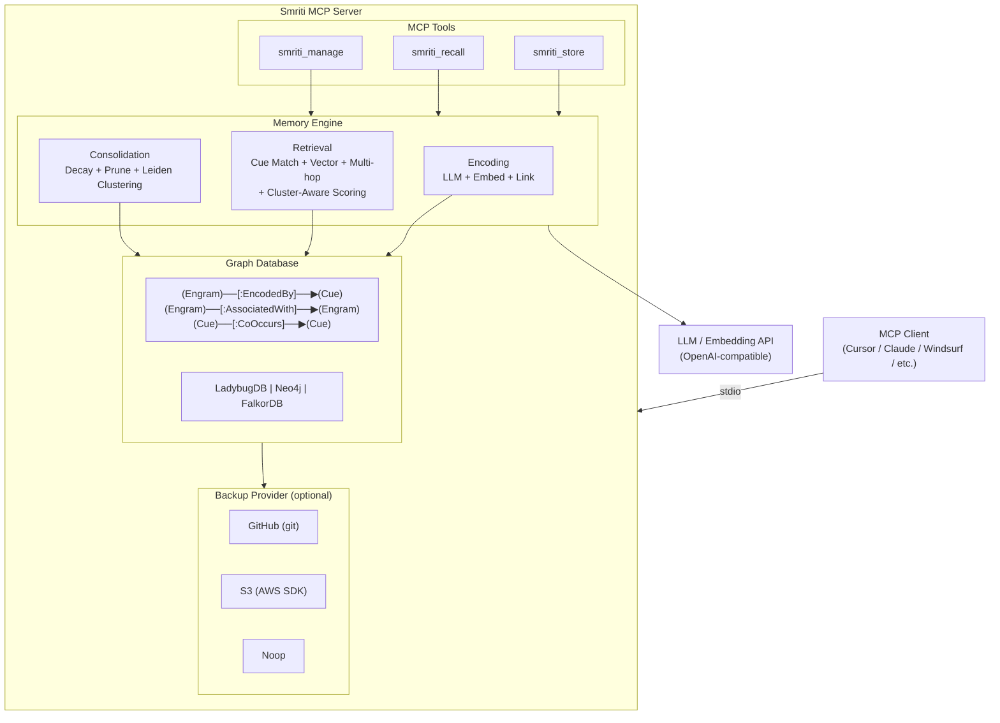

<p align="center">
  
</p>

<h1 align="center">Smriti MCP</h1>

<p align="center">
  <a href="https://go.dev/"></a>
  <a href="https://opensource.org/licenses/MPL-2.0"></a>
  <a href="https://modelcontextprotocol.io/"></a>
  <a href="https://hub.docker.com/r/tejzpr/smriti-mcp"></a>
  <a href="https://github.com/tejzpr/smriti-mcp/actions"></a>
</p>

<p align="center"><strong>Graph-Based AI Memory System with EcphoryRAG Retrieval and Leiden Clustering</strong></p>

Smriti is a Model Context Protocol (MCP) server that provides persistent, graph-based memory for LLM applications. It supports three database backends — [LadybugDB](https://ladybugdb.com) (embedded), [Neo4j](https://neo4j.com), and [FalkorDB](https://www.falkordb.com) — and uses [EcphoryRAG](https://arxiv.org/abs/2510.08958)-inspired multi-stage retrieval — combining cue extraction, graph traversal, vector similarity, and multi-hop association — to deliver human-like memory recall. Smriti uses the [Leiden algorithm](https://en.wikipedia.org/wiki/Leiden_algorithm) for automatic community detection, enabling cluster-aware retrieval that scales beyond thousands of memories.

## Features

- **Graph-Based Memory** — Engrams (memories) linked via Cues and Associations in a property graph
- **EcphoryRAG Retrieval** — Multi-hop associative recall with cue extraction, vector similarity, and composite scoring
- **Leiden Community Detection** — Automatic clustering of related memories using the Leiden algorithm with smart-cached resolution tuning, enabling cluster-aware scoring for efficient retrieval at scale
- **Multi-Backend Support** — LadybugDB (embedded, zero-config), Neo4j (enterprise graph DB), or FalkorDB (Redis-based graph DB)
- **Multi-User Isolation** — Per-file (LadybugDB), per-tenant property or per-database (Neo4j), or per-tenant property or per-graph (FalkorDB)
- **Automatic Consolidation** — Exponential decay, pruning of weak memories, strengthening of frequently accessed ones, and periodic Leiden re-clustering
- **Flexible Backup** — GitHub (system git) or S3 (AWS SDK) sync, plus noop for local-only
- **Lazy HNSW Indexing** — Vector and FTS indexes created on-demand when dataset exceeds threshold
- **OpenAI-Compatible APIs** — Works with any OpenAI-compatible LLM and embedding provider
- **3 MCP Tools** — `smriti_store`, `smriti_recall`, `smriti_manage`

## Architecture



### Recall Pipeline

The default `recall` mode performs multi-stage retrieval:

1. **Cue Extraction** — LLM extracts entities and keywords from the query
2. **Cue-Based Graph Traversal** — Follows `EncodedBy` edges to find engrams linked to matching cues
3. **Vector Similarity Search** — Cosine similarity against all engram embeddings (HNSW index when available, fallback to brute-force)
4. **Multi-Hop Expansion** — Follows `AssociatedWith` edges to discover related memories
5. **Cluster-Aware Composite Scoring** — Blends vector similarity (40%), recency (20%), importance (20%), and decay (20%), with hop-depth penalty and soft-bounded cross-cluster penalty (0.5x for hop results outside the seed cluster)
6. **Access Strengthening** — Recalled engrams get their access count and decay factor bumped (reinforcement)

### Leiden Clustering

Smriti uses the [Leiden algorithm](https://en.wikipedia.org/wiki/Leiden_algorithm) — an improvement over Louvain that guarantees well-connected communities — to automatically detect clusters of related memories in the graph.

**How it works:**
- Runs automatically during each consolidation cycle
- Builds a weighted undirected graph from `AssociatedWith` edges between engrams
- Auto-tunes the resolution parameter using community profiling on the first run
- Uses a **smart cache**: the tuned resolution is reused across runs and only re-tuned when the graph grows by more than 10%
- Assigns a `cluster_id` to each engram, stored persistently in the database
- New engrams inherit the `cluster_id` of their strongest neighbor at encode time

**How it improves retrieval:**
- The recall pipeline determines a **seed cluster** (most common cluster among direct-match results)
- Multi-hop results that cross into a different cluster receive a **0.5x score penalty** (soft-bounded: they are penalized, not dropped)
- This keeps retrieval focused within the most relevant topic cluster while still allowing cross-topic discovery

**Performance characteristics:**
- Gracefully skips on small graphs (< 3 nodes or 0 edges)
- Clustering 60 nodes: ~40ms (first run with auto-tune), ~14ms (cached resolution)
- Per-user: each Engine instance maintains its own independent cache

### Consolidation Pipeline

Consolidation runs periodically (default: every 3600 seconds) and performs:

1. **Exponential Decay** — Reduces `decay_factor` based on time since last access
2. **Weak Memory Pruning** — Removes engrams below minimum decay threshold
3. **Frequency Strengthening** — Boosts decay factor for frequently accessed memories
4. **Orphaned Cue Cleanup** — Removes cues no longer linked to any engram
5. **Leiden Clustering** — Re-clusters the memory graph (smart-cached, skips if graph hasn't changed significantly)
6. **Index Management** — Creates HNSW vector and FTS indexes when engram count exceeds threshold (50)

## Requirements

- **Go 1.25+** — For building from source
- **Git 2.x+** — Required for GitHub backup provider (must be in PATH)
- **GCC/Build Tools** — Required for CGO (LadybugDB backend)
  - macOS: `xcode-select --install`
  - Linux: `sudo apt install build-essential`
  - Windows: Use Docker (recommended) or MinGW
- **liblbug (LadybugDB shared library)** — Runtime dependency for LadybugDB backend, downloaded automatically by `go-ladybug` during build. If building manually, grab the latest release from [LadybugDB/ladybug](https://github.com/LadybugDB/ladybug/releases):

  | Platform | Asset | Library |
  |----------|-------|---------|
  | macOS | `liblbug-osx-arm64.tar.gz` / `liblbug-osx-x86_64.tar.gz` | `liblbug.dylib` |
  | Linux | `liblbug-linux-{arch}.tar.gz` | `liblbug.so` |
  | Windows | `liblbug-windows-x86_64.zip` | `liblbug.dll` |

  The shared library must be on the system library path at runtime (e.g., `DYLD_LIBRARY_PATH` on macOS, `LD_LIBRARY_PATH` on Linux, or alongside the binary on Windows). Docker and release binaries bundle this automatically.
- **Neo4j 5.x+** — Required only when using `DB_TYPE=neo4j`. Must have APOC and GDS plugins for vector search and full-text indexing.
- **FalkorDB** — Required only when using `DB_TYPE=falkordb`. Runs on Redis protocol (default port 6379).

## Quick Start

### 1. Build

```bash
# Build
CGO_ENABLED=1 go build -o smriti-mcp .

# Run (minimal config)
export LLM_API_KEY=your-api-key
export ACCESSING_USER=alice
./smriti-mcp
```

### 2. MCP Client Integration

#### Option 1: Native Binary

**Cursor** (`~/.cursor/mcp_settings.json`):
```json
{
  "mcpServers": {
    "smriti": {
      "command": "/path/to/smriti-mcp",
      "env": {
        "LLM_API_KEY": "your-api-key",
        "EMBEDDING_API_KEY": "your-embedding-key"
      }
    }
  }
}
```

**Claude Desktop** (`~/Library/Application Support/Claude/claude_desktop_config.json`):
```json
{
  "mcpServers": {
    "smriti": {
      "command": "/path/to/smriti-mcp",
      "args": [],
      "env": {
        "LLM_API_KEY": "your-api-key",
        "EMBEDDING_API_KEY": "your-embedding-key"
      }
    }
  }
}
```

**Windsurf** (`~/.codeium/windsurf/mcp_config.json`):
```json
{
  "mcpServers": {
    "smriti": {
      "command": "/path/to/smriti-mcp",
      "env": {
        "LLM_API_KEY": "your-api-key",
        "EMBEDDING_API_KEY": "your-embedding-key"
      }
    }
  }
}
```

#### Option 2: Go Run

Run directly without installing — similar to `npx` for Node.js:

```json
{
  "mcpServers": {
    "smriti": {
      "command": "go",
      "args": ["run", "github.com/tejzpr/smriti-mcp@latest"],
      "env": {
        "LLM_API_KEY": "your-api-key",
        "EMBEDDING_API_KEY": "your-embedding-key"
      }
    }
  }
}
```

#### Option 3: Docker Container

**Simple mode (single user):**

```json
{
  "mcpServers": {
    "smriti": {
      "command": "docker",
      "args": [
        "run", "-i", "--rm",
        "-v", "/Users/yourname/.smriti:/home/smriti/.smriti",
        "-e", "LLM_API_KEY=your-api-key",
        "-e", "EMBEDDING_API_KEY=your-embedding-key",
        "tejzpr/smriti-mcp"
      ]
    }
  }
}
```

**Multi-user mode:**

```json
{
  "mcpServers": {
    "smriti": {
      "command": "docker",
      "args": [
        "run", "-i", "--rm",
        "-v", "/Users/yourname/.smriti:/home/smriti/.smriti",
        "-e", "LLM_API_KEY=your-api-key",
        "-e", "EMBEDDING_API_KEY=your-embedding-key",
        "-e", "ACCESSING_USER=yourname",
        "tejzpr/smriti-mcp"
      ]
    }
  }
}
```

> **Note:**
> - Replace `/Users/yourname` with your actual home directory path
> - MCP clients do not expand `$HOME` or `~` in JSON configs — use absolute paths
> - The `.smriti` volume mount persists your memory database
> - The container runs as non-root user `smriti`

**Build locally (optional):**

```bash
docker build -t smriti-mcp .
```

Then use `smriti-mcp` instead of `tejzpr/smriti-mcp` in your config.

#### Option 4: GitHub Release Binary

Download pre-built binaries from the [Releases](https://github.com/tejzpr/smriti-mcp/releases) page. Binaries are available for:

| Platform | Architecture | CGO |
|----------|-------------|-----|
| Linux | amd64 | Enabled (native) |
| macOS | arm64 (Apple Silicon) | Enabled (native) |
| Windows | amd64 | Enabled (native) |

Each release includes a `checksums-sha256.txt` for verification.

## Environment Variables

### Core

| Variable | Default | Description |
|---|---|---|
| `ACCESSING_USER` | OS username | User identifier (used for DB isolation) |
| `STORAGE_LOCATION` | `~/.smriti` | Root storage directory (LadybugDB only) |
| `DB_TYPE` | `ladybug` | Database backend: `ladybug`, `neo4j`, or `falkordb` |

### LLM

| Variable | Default | Description |
|---|---|---|
| `LLM_BASE_URL` | `https://api.openai.com/v1` | LLM API endpoint (OpenAI-compatible) |
| `LLM_API_KEY` | _(required)_ | LLM API key |
| `LLM_MODEL` | `gpt-4o-mini` | LLM model name |

### Embedding

| Variable | Default | Description |
|---|---|---|
| `EMBEDDING_BASE_URL` | `https://api.openai.com/v1` | Embedding API endpoint |
| `EMBEDDING_API_KEY` | _(falls back to LLM_API_KEY)_ | Embedding API key |
| `EMBEDDING_MODEL` | `text-embedding-3-small` | Embedding model name |
| `EMBEDDING_DIMS` | `1536` | Embedding vector dimensions |

### Backup

| Variable | Default | Description |
|---|---|---|
| `BACKUP_TYPE` | `none` | `none`, `github`, or `s3` |
| `BACKUP_SYNC_INTERVAL` | `60` | Seconds between backup syncs (0 = disabled) |
| `GIT_BASE_URL` | _(empty)_ | Git remote base URL (required if `github`) |
| `S3_ENDPOINT` | _(empty)_ | S3 endpoint (for non-AWS providers) |
| `S3_REGION` | _(empty)_ | S3 region (required if `s3`) |
| `S3_ACCESS_KEY` | _(empty)_ | S3 access key (required if `s3`) |
| `S3_SECRET_KEY` | _(empty)_ | S3 secret key (required if `s3`) |

### Neo4j (when DB_TYPE=neo4j)

| Variable | Default | Description |
|---|---|---|
| `NEO4J_URI` | _(required)_ | Bolt URI (e.g. `bolt://localhost:7687`) |
| `NEO4J_USERNAME` | _(required)_ | Neo4j username |
| `NEO4J_PASSWORD` | _(required)_ | Neo4j password |
| `NEO4J_DATABASE` | `neo4j` | Database name (overridden by username in `database` isolation mode) |
| `NEO4J_ISOLATION` | `tenant` | `tenant` (property-based, Community Edition) or `database` (per-DB, Enterprise Edition) |

### FalkorDB (when DB_TYPE=falkordb)

| Variable | Default | Description |
|---|---|---|
| `FALKOR_ADDR` | `localhost:6379` | FalkorDB Redis address |
| `FALKOR_PASSWORD` | _(empty)_ | FalkorDB password (if auth enabled) |
| `FALKOR_GRAPH` | `smriti` | Graph name (overridden by `{user}_smriti` in `graph` isolation mode) |
| `FALKOR_ISOLATION` | `tenant` | `tenant` (property-based) or `graph` (per-graph isolation) |

### Consolidation

| Variable | Default | Description |
|---|---|---|
| `CONSOLIDATION_INTERVAL` | `3600` | Seconds between consolidation runs (0 = disabled) |

## MCP Tools

### smriti_store

**"Remember this"** — Store a new memory. Content is automatically analyzed by the LLM, embedded, and woven into the memory graph. New engrams inherit the `cluster_id` of their most similar existing neighbor.

```json
{
  "content": "Kubernetes uses etcd as its backing store for all cluster data",
  "importance": 0.8,
  "tags": "kubernetes,etcd,infrastructure",
  "source": "meeting-notes"
}
```

| Parameter | Type | Required | Description |
|---|---|---|---|
| `content` | string | yes | Memory content |
| `importance` | number | no | Priority 0.0–1.0 (default: 0.5) |
| `tags` | string | no | Comma-separated tags |
| `source` | string | no | Source/origin label |

### smriti_recall

**"What do I know about X?"** — Retrieve memories using multi-stage EcphoryRAG retrieval with cluster-aware scoring.

```json
{
  "query": "container orchestration tools",
  "limit": 5,
  "mode": "recall"
}
```

| Parameter | Type | Required | Description |
|---|---|---|---|
| `query` | string | no | Natural language query (omit for list mode) |
| `limit` | number | no | Max results (default: 5) |
| `mode` | string | no | `recall` (deep multi-hop), `search` (fast vector-only), or `list` (browse) |
| `memory_type` | string | no | Filter: `episodic`, `semantic`, `procedural` |

**Modes explained:**
- **`recall`** (default) — Full pipeline: cue extraction → graph traversal → vector search → multi-hop → cluster-aware composite scoring
- **`search`** — Vector-only cosine similarity. Faster but shallower.
- **`list`** — No search. Returns recent memories ordered by last access time.

### smriti_manage

**"Forget this / sync now"** — Administrative operations.

```json
{
  "action": "forget",
  "memory_id": "abc-123-def"
}
```

| Parameter | Type | Required | Description |
|---|---|---|---|
| `action` | string | yes | `forget` (delete memory) or `sync` (push backup) |
| `memory_id` | string | if forget | Engram ID to delete |

## Graph Schema

Smriti stores memories in a property graph with the following structure:

```
Node Tables:
  Engram   — id, content, summary, memory_type, importance, access_count,
              created_at, last_accessed_at, decay_factor, embedding, source,
              tags, cluster_id
  Cue      — id, name, cue_type, embedding

Relationship Tables:
  EncodedBy      — (Engram) → (Cue)
  AssociatedWith — (Engram) → (Engram)  [strength, relation_type, created_at]
  CoOccurs       — (Cue) → (Cue)       [strength]
```

The `cluster_id` field on Engram nodes is managed by the Leiden algorithm. A value of `-1` indicates the engram has not yet been assigned to a cluster (e.g., the graph is too small, or the engram has no associations).

## Storage & Isolation

Smriti supports three database backends with different storage and isolation models:

### LadybugDB (default)

Each user gets an isolated embedded database file:

```
~/.smriti/
└── {username}/
    └── memory.lbug     # LadybugDB property graph database
```

The `STORAGE_LOCATION` env var controls the root. The `ACCESSING_USER` env var selects which user's DB to open. Backup providers sync the user directory to remote storage.

### Neo4j

Two isolation modes controlled by `NEO4J_ISOLATION`:

- **`tenant`** (default) — All users share one database. Each node gets a `user` property and all queries filter by it. Works on Neo4j Community Edition.
- **`database`** — Each user gets a separate Neo4j database. Requires Neo4j Enterprise Edition.

### FalkorDB

Two isolation modes controlled by `FALKOR_ISOLATION`:

- **`tenant`** (default) — All users share one graph. Each node gets a `user` property and all queries filter by it.
- **`graph`** — Each user gets a separate graph (named `{user}_smriti`).

Schema migrations (e.g., adding `cluster_id` to existing databases) run automatically on startup.

## Project Structure

```
smriti-mcp/
├── main.go              # Entry point, server setup, signal handling
├── config/              # Environment variable parsing
├── llm/                 # OpenAI-compatible HTTP client (LLM + embeddings)
├── db/                  # Database backends (LadybugDB, Neo4j, FalkorDB), schema, indexes, migrations
├── memory/
│   ├── engine.go        # Engine struct, consolidation loop
│   ├── types.go         # Engram, Cue, Association, SearchResult structs
│   ├── encoding.go      # Store pipeline: LLM extraction → embed → link → cluster inherit
│   ├── retrieval.go     # Recall pipeline: cue search → vector → multi-hop → cluster scoring
│   ├── search.go        # Search modes: list, vector-only, FTS, hybrid
│   ├── consolidation.go # Decay, prune, strengthen, orphan cleanup
│   └── leiden.go        # Leiden clustering: graph build, auto-tune, smart cache, batch write
├── backup/              # Backup providers: noop, github (git), s3 (AWS SDK)
├── tools/               # MCP tool definitions: store, recall, manage
└── testutil/            # Shared test helpers
```

## Testing

```bash
# Run unit tests
CGO_ENABLED=1 go test ./...

# Verbose with all output
CGO_ENABLED=1 go test -v ./...

# Specific package
CGO_ENABLED=1 go test -v ./memory/...
CGO_ENABLED=1 go test -v ./tools/...

# Leiden clustering tests only
CGO_ENABLED=1 go test -v -run "TestRunLeiden|TestNeedsRetune|TestDetermineSeedCluster" ./memory/
```

### E2E / Integration Tests

E2E tests require real LLM/embedding services and are gated behind the `integration` build tag:

```bash
# LadybugDB E2E (no external DB required)
CGO_ENABLED=1 go test -tags integration -v -run "TestE2E_LadybugDB" ./memory/

# Neo4j E2E (requires running Neo4j instance)
NEO4J_URI="bolt://localhost:7687" NEO4J_USERNAME="neo4j" NEO4J_PASSWORD="yourpass" \
  CGO_ENABLED=1 go test -tags integration -v -run "TestE2E_Neo4j" ./memory/

# FalkorDB E2E (requires running FalkorDB instance)
FALKOR_ADDR="localhost:6379" \
  CGO_ENABLED=1 go test -tags integration -v -run "TestE2E_FalkorDB" ./memory/

# All E2E tests
CGO_ENABLED=1 go test -tags integration -v -run "TestE2E_" ./memory/
```

All E2E tests require `LLM_BASE_URL`, `LLM_API_KEY`, `LLM_MODEL`, `EMBEDDING_BASE_URL`, `EMBEDDING_MODEL`, and `EMBEDDING_API_KEY` environment variables.

## Contributing

Contributions are welcome! Please ensure:
- All tests pass (`CGO_ENABLED=1 go test ./...`)
- Code is properly formatted (`go fmt ./...`)
- New code includes the SPDX license header

See [CONTRIBUTORS.md](CONTRIBUTORS.md) for the contributor list.

## License

This project is licensed under the [Mozilla Public License 2.0](LICENSE).
