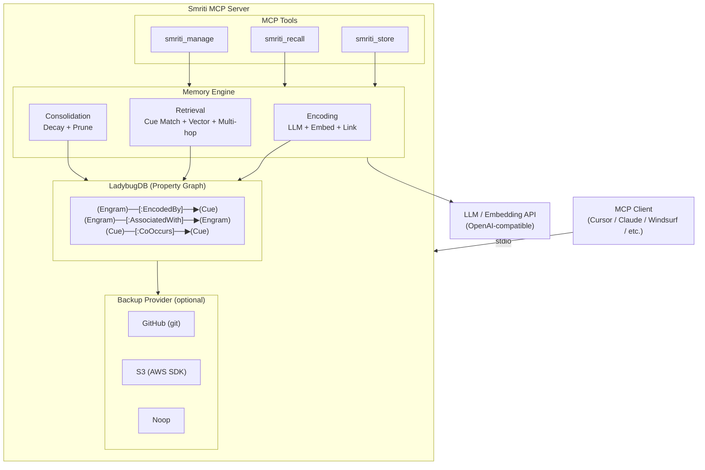

<p align="center">
  
</p>

<h1 align="center">Smriti MCP</h1>

<p align="center">
  <a href="https://go.dev/"></a>
  <a href="https://opensource.org/licenses/MPL-2.0"></a>
  <a href="https://modelcontextprotocol.io/"></a>
  <a href="https://hub.docker.com/r/tejzpr/smriti-mcp"></a>
  <a href="https://github.com/tejzpr/smriti-mcp/actions"></a>
</p>

<p align="center"><strong>Graph-Based AI Memory System with EcphoryRAG Retrieval</strong></p>

Smriti is a Model Context Protocol (MCP) server that provides persistent, graph-based memory for LLM applications. Built on [LadybugDB](https://ladybugdb.com) (embedded property graph database), it uses [EcphoryRAG](https://arxiv.org/abs/2510.08958)-inspired multi-stage retrieval - combining cue extraction, graph traversal, vector similarity, and multi-hop association - to deliver human-like memory recall.

## Features

- **Graph-Based Memory**: Engrams (memories) linked via Cues and Associations in a property graph
- **EcphoryRAG Retrieval**: Multi-hop associative recall with cue extraction, vector similarity, and composite scoring
- **Multi-User Support**: Separate LadybugDB per user - scales to thousands of isolated memory stores
- **Automatic Consolidation**: Exponential decay, pruning of weak memories, strengthening of frequently accessed ones
- **Flexible Backup**: GitHub (system git) or S3 (AWS SDK) sync, plus noop for local-only
- **Lazy HNSW Indexing**: Vector and FTS indexes created on-demand when dataset exceeds threshold
- **OpenAI-Compatible APIs**: Works with any OpenAI-compatible LLM and embedding provider
- **3 MCP Tools**: `smriti_store`, `smriti_recall`, `smriti_manage`

## Architecture



### Recall Pipeline

The default `recall` mode performs multi-stage retrieval:

1. **Cue Extraction** - LLM extracts entities and keywords from the query
2. **Cue-Based Graph Traversal** - Follows `EncodedBy` edges to find engrams linked to matching cues
3. **Vector Similarity Search** - Cosine similarity against all engram embeddings
4. **Multi-Hop Expansion** - Follows `AssociatedWith` edges to discover related memories
5. **Composite Scoring** - Blends vector similarity, cue match strength, recency, and importance
6. **Access Strengthening** - Recalled engrams get their access count bumped (reinforcement)

## Requirements

- **Go 1.25+** - For building from source
- **Git 2.x+** - Required for GitHub backup provider (must be in PATH)
- **GCC/Build Tools** - Required for CGO (LadybugDB)
  - macOS: `xcode-select --install`
  - Linux: `sudo apt install build-essential`
  - Windows: Use Docker (recommended) or MinGW

## Quick Start

### 1. Build

```bash
# Build
CGO_ENABLED=1 go build -o smriti-mcp .

# Run (minimal config)
export LLM_API_KEY=your-api-key
export ACCESSING_USER=alice
./smriti-mcp
```

### 2. MCP Client Integration

#### Option 1: Native Binary

**Cursor** (`~/.cursor/mcp_settings.json`):
```json
{
  "mcpServers": {
    "smriti": {
      "command": "/path/to/smriti-mcp",
      "env": {
        "LLM_API_KEY": "your-api-key",
        "EMBEDDING_API_KEY": "your-embedding-key"
      }
    }
  }
}
```

**Claude Desktop** (`~/Library/Application Support/Claude/claude_desktop_config.json`):
```json
{
  "mcpServers": {
    "smriti": {
      "command": "/path/to/smriti-mcp",
      "args": [],
      "env": {
        "LLM_API_KEY": "your-api-key",
        "EMBEDDING_API_KEY": "your-embedding-key"
      }
    }
  }
}
```

**Windsurf** (`~/.codeium/windsurf/mcp_config.json`):
```json
{
  "mcpServers": {
    "smriti": {
      "command": "/path/to/smriti-mcp",
      "env": {
        "LLM_API_KEY": "your-api-key",
        "EMBEDDING_API_KEY": "your-embedding-key"
      }
    }
  }
}
```

#### Option 2: Go Run

Run directly without installing - similar to `npx` for Node.js:

```json
{
  "mcpServers": {
    "smriti": {
      "command": "go",
      "args": ["run", "github.com/tejzpr/smriti-mcp@latest"],
      "env": {
        "LLM_API_KEY": "your-api-key",
        "EMBEDDING_API_KEY": "your-embedding-key"
      }
    }
  }
}
```

#### Option 3: Docker Container

**Simple mode (single user):**

```json
{
  "mcpServers": {
    "smriti": {
      "command": "docker",
      "args": [
        "run", "-i", "--rm",
        "-v", "/Users/yourname/.smriti:/home/smriti/.smriti",
        "-e", "LLM_API_KEY=your-api-key",
        "-e", "EMBEDDING_API_KEY=your-embedding-key",
        "tejzpr/smriti-mcp"
      ]
    }
  }
}
```

**Multi-user mode:**

```json
{
  "mcpServers": {
    "smriti": {
      "command": "docker",
      "args": [
        "run", "-i", "--rm",
        "-v", "/Users/yourname/.smriti:/home/smriti/.smriti",
        "-e", "LLM_API_KEY=your-api-key",
        "-e", "EMBEDDING_API_KEY=your-embedding-key",
        "-e", "ACCESSING_USER=yourname",
        "tejzpr/smriti-mcp"
      ]
    }
  }
}
```

> **Note:**
> - Replace `/Users/yourname` with your actual home directory path
> - MCP clients do not expand `$HOME` or `~` in JSON configs - use absolute paths
> - The `.smriti` volume mount persists your memory database
> - The container runs as non-root user `smriti`

**Build locally (optional):**

```bash
docker build -t smriti-mcp .
```

Then use `smriti-mcp` instead of `tejzpr/smriti-mcp` in your config.

#### Option 4: GitHub Release Binary

Download pre-built binaries from the [Releases](https://github.com/tejzpr/smriti-mcp/releases) page. Binaries are available for:

| Platform | Architecture | CGO |
|----------|-------------|-----|
| Linux | amd64, arm64 | Enabled (static musl) |
| macOS | amd64 (Intel), arm64 (Apple Silicon) | Enabled (via Zig) |
| Windows | amd64 | Enabled (via Zig) |

Each binary includes a `.sha256` checksum for verification.

## Environment Variables

### Core

| Variable | Default | Description |
|---|---|---|
| `ACCESSING_USER` | OS username | User identifier (separate DB per user) |
| `STORAGE_LOCATION` | `~/.smriti` | Root storage directory |

### LLM

| Variable | Default | Description |
|---|---|---|
| `LLM_BASE_URL` | `https://api.openai.com/v1` | LLM API endpoint (OpenAI-compatible) |
| `LLM_API_KEY` | _(required)_ | LLM API key |
| `LLM_MODEL` | `gpt-4o-mini` | LLM model name |

### Embedding

| Variable | Default | Description |
|---|---|---|
| `EMBEDDING_BASE_URL` | `https://api.openai.com/v1` | Embedding API endpoint |
| `EMBEDDING_API_KEY` | _(falls back to LLM_API_KEY)_ | Embedding API key |
| `EMBEDDING_MODEL` | `text-embedding-3-small` | Embedding model name |
| `EMBEDDING_DIMS` | `1536` | Embedding vector dimensions |

### Backup

| Variable | Default | Description |
|---|---|---|
| `BACKUP_TYPE` | `none` | `none`, `github`, or `s3` |
| `BACKUP_SYNC_INTERVAL` | `60` | Seconds between backup syncs (0 = disabled) |
| `GIT_BASE_URL` | _(empty)_ | Git remote base URL (required if `github`) |
| `S3_ENDPOINT` | _(empty)_ | S3 endpoint (for non-AWS providers) |
| `S3_REGION` | _(empty)_ | S3 region (required if `s3`) |
| `S3_ACCESS_KEY` | _(empty)_ | S3 access key (required if `s3`) |
| `S3_SECRET_KEY` | _(empty)_ | S3 secret key (required if `s3`) |

### Consolidation

| Variable | Default | Description |
|---|---|---|
| `CONSOLIDATION_INTERVAL` | `3600` | Seconds between consolidation runs (0 = disabled) |

## MCP Tools

### smriti_store

**"Remember this"** - Store a new memory. Content is automatically analyzed by the LLM, embedded, and woven into the memory graph.

```json
{
  "content": "Kubernetes uses etcd as its backing store for all cluster data",
  "importance": 0.8,
  "tags": "kubernetes,etcd,infrastructure",
  "source": "meeting-notes"
}
```

| Parameter | Type | Required | Description |
|---|---|---|---|
| `content` | string | yes | Memory content |
| `importance` | number | no | Priority 0.0–1.0 (default: 0.5) |
| `tags` | string | no | Comma-separated tags |
| `source` | string | no | Source/origin label |

### smriti_recall

**"What do I know about X?"** - Retrieve memories using multi-stage EcphoryRAG retrieval.

```json
{
  "query": "container orchestration tools",
  "limit": 5,
  "mode": "recall"
}
```

| Parameter | Type | Required | Description |
|---|---|---|---|
| `query` | string | no | Natural language query (omit for list mode) |
| `limit` | number | no | Max results (default: 5) |
| `mode` | string | no | `recall` (deep multi-hop), `search` (fast vector-only), or `list` (browse) |
| `memory_type` | string | no | Filter: `episodic`, `semantic`, `procedural` |

**Modes explained:**
- **`recall`** (default) - Full pipeline: cue extraction → graph traversal → vector search → multi-hop → composite scoring
- **`search`** - Vector-only cosine similarity. Faster but shallower.
- **`list`** - No search. Returns recent memories ordered by creation time.

### smriti_manage

**"Forget this / sync now"** - Administrative operations.

```json
{
  "action": "forget",
  "memory_id": "abc-123-def"
}
```

| Parameter | Type | Required | Description |
|---|---|---|---|
| `action` | string | yes | `forget` (delete memory) or `sync` (push backup) |
| `memory_id` | string | if forget | Engram ID to delete |

## Storage

Each user gets an isolated LadybugDB file:

```
~/.smriti/
└── {username}/
    └── memory.lbug     # LadybugDB property graph database
```

The `STORAGE_LOCATION` env var controls the root. The `ACCESSING_USER` env var selects which user's DB to open. Backup providers sync the user directory to remote storage.

## Testing

```bash
# Run all unit tests
CGO_ENABLED=1 go test ./...

# Verbose with all output
CGO_ENABLED=1 go test -v ./...

# Specific package
CGO_ENABLED=1 go test -v ./memory/...
CGO_ENABLED=1 go test -v ./tools/...
```

## Contributing

Contributions are welcome! Please ensure:
- All tests pass (`CGO_ENABLED=1 go test ./...`)
- Code is properly formatted (`go fmt ./...`)
- New code includes the SPDX license header

See [CONTRIBUTORS.md](CONTRIBUTORS.md) for the contributor list.

## License

This project is licensed under the [Mozilla Public License 2.0](LICENSE).
